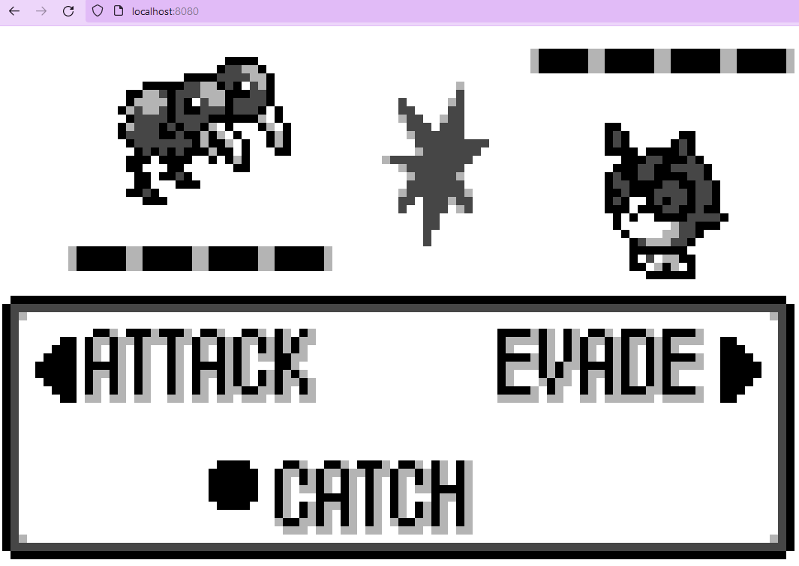

Pokewalker Utils
=============================================

This repository provides some utility scripts emulating [Pokewalker](https://bulbapedia.bulbagarden.net/wiki/Pok%C3%A9walker) behavior in DeSmuME, providing an interfaces to modify the emulated Pokewalker EEPROM and extracting assets from it.
Most of this is based on the amazing research and documentation of [Dmitry.GR](https://dmitry.gr/?r=05.Projects&proj=28.%20pokewalker).

# DeSmuME Pokewalker Communication

## Requirements

For this to work a dev build of DeSmuME is required, as it appears that execution hooks are a dev build only feature.
For the communication wit the python script to work the `socket.lua` library needs to be installed fitting for the lua version of the emulator.

The memory hooks are explicitly for the US Version of HeartGold, adjusting them for other ROMs should be relatively easy though.

## Running it

With the correct ROM, starting the `pokewalker_interface.py` will wait for a connection.
Running the `desmumePokewalker.lua` inside DeSmuME should then connect to it.
The script should only run while in the menu, and after each connection to the "Pokewalker" the script should be restarted to reconnect.

Transferring a Pokemon should look something like this:

After the process is finished, a `eeprom.bin` file should have been created, this file contains all the Pokewalker data.

The binary file is loaded again for each transaction with the Pokewalker. Without any modifications returning a Pokemon should look similar to this:

## How does this work?

The cartridge and the Pokewalker normally communicate using an IRDA Transceiver. The game talks to this Transceiver using [Auxiliary SPI](https://problemkaputt.de/gbatek-ds-cartridge-i-o-ports.htm).
The `desmumePokewalker.lua` DeSmuME script hooks the code parts responsible for reading and writing, handles the (very weak) encryption and decryption, and redirects the data as packets to `127.0.0.1:54545` and reads the responses from there.
Interestingly parts of this is [already implemented in DeSmuMe](https://github.com/TASEmulators/desmume/blob/d854909b040b021ef027d53cbfd6555b175c1bb8/desmume/src/mc.cpp) but I decided against modifying the emulator itself. (Given how tedious the installation of the dev-build + lua + sockets setup is, this was maybe a mistake). 
`pokewalker_interface.py` accepts these connections and uses the `pokewalker.py` to emulate the message handling like a Pokewalker, based on [Dmitry.GR's](https://dmitry.gr/?r=05.Projects&proj=28.%20pokewalker) documentation and what I understood from the Pokewalker Disassembly Dump.
The way the game sends Pokemon to the Pokewalker is by overwriting the entire asset-memory of the Pokewalker. When receiving Gifts or Pokemon it doesn't read the entire memory back.
As the `pokewalker.py` script saves the entire received asset-memory into the `eeprom.bin` file, this file not only contains the data of the received Pokemon, but also all images, strings, etc (See Dmitry's EEPROM Map for details).

# Working with the Binary Image

The `pokewalker_eeprom.py` script provides an interface to some functions for modifying the `eeprom.bin` file.

From adding Steps and Watts:

To catching Pokemon and finding Items from the Route:

There is a lot more possible (but not implemented) as shown in Dmitry's article.

# Web Interface Stuff

Additionally the `pokewalker_flask.py` script contains code for dynamically parsing the `eeprom.bin` and extracting the images and data from it.
In combination with the `html/index.html` this allows for accessing the resources in a web interface.
This could potentially be used for a web-port of the Pokewalker logic or similar (I planned to do that, but eventually lost interest).

# Links

- https://problemkaputt.de/gbatek-ds-cartridge-i-o-ports.htm
- https://github.com/TASEmulators/desmume/blob/d854909b040b021ef027d53cbfd6555b175c1bb8/desmume/src/mc.cpp
- https://dmitry.gr/?r=05.Projects&proj=28.%20pokewalker
- https://github.com/pret/pokeheartgold/tree/master